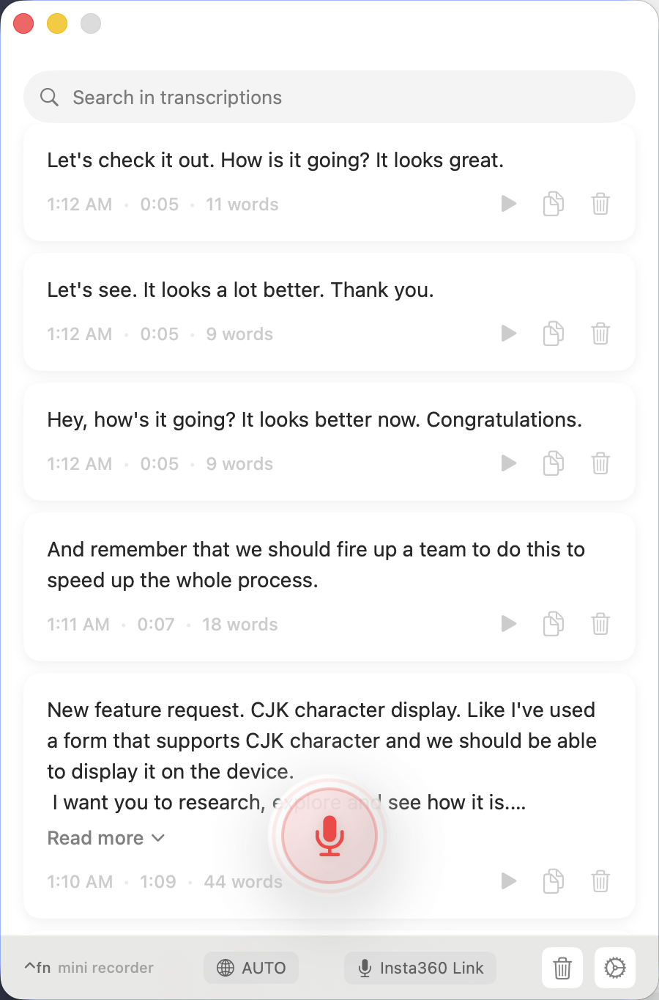
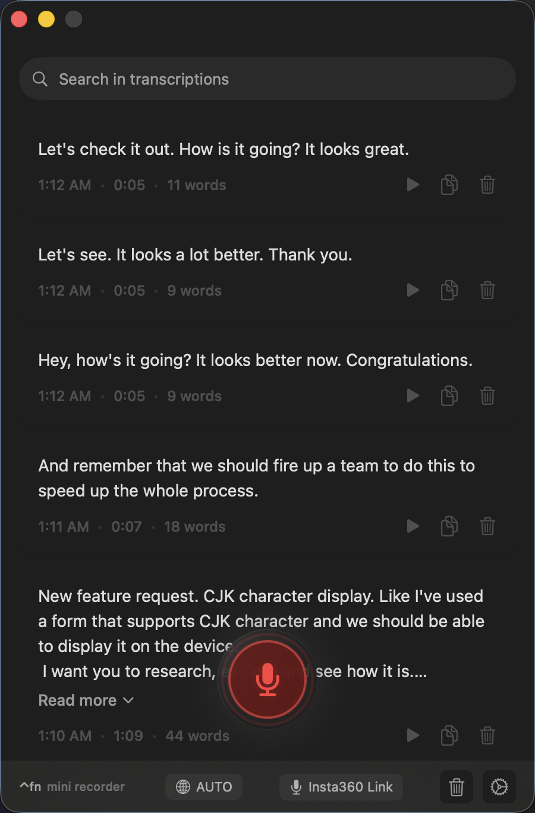

# OpenSuperWhisper

A powerful macOS menu bar app for local speech-to-text transcription using [whisper.cpp](https://github.com/ggerganov/whisper.cpp). Runs entirely offline with downloaded Whisper models.

<p align="center">
 
</p>

## Features

- 🎙️ **Local Transcription** - Runs entirely offline using Whisper models
- ⌨️ **Global Shortcuts** - Quick recording with customizable hotkeys (default: `Option + Backtick`)
- 📋 **Auto-Paste** - Automatically paste transcriptions into the active text field (with Accessibility permission)
- 🔊 **System Audio Capture** - Transcribe audio from any app playing on your Mac
- 🌍 **Multi-Language** - Auto-detect language or select from 50+ supported languages
- 🇯🇵🇨🇳🇰🇷 **Asian Language Support** - Smart formatting for CJK text with [autocorrect](https://github.com/huacnlee/autocorrect)
- ⚡ **CoreML Acceleration** - Optional Neural Engine support for faster transcription
- 📥 **Resumable Downloads** - Download models with pause/resume support
- 💾 **Recording History** - Search and manage past transcriptions

## Installation

Download the latest DMG from the [Releases page](https://github.com/happyjake/OpenSuperWhisper/releases).

Or build from source (see below).

## Requirements

- macOS 14.0 or later
- Apple Silicon (M1/M2/M3)

## Usage

1. **First Launch**: Grant microphone permission when prompted
2. **Record**: Press `Option + Backtick` (or your custom shortcut) to start/stop recording
3. **Transcription**: Text is automatically copied to clipboard after transcription
4. **Auto-Paste** (Optional): Enable in Settings > Shortcuts > Accessibility to auto-paste into text fields

### Permissions

- **Microphone**: Required for voice recording
- **Accessibility** (Optional): Enables auto-paste and positions the indicator near your text cursor
- **System Audio** (Optional): Required to capture audio from other apps

## Building from Source

```bash
git clone https://github.com/happyjake/OpenSuperWhisper.git
cd OpenSuperWhisper
git submodule update --init --recursive
brew install cmake libomp rust ruby
gem install xcpretty
./run.sh
```

## Whisper Models

Models are downloaded automatically from Hugging Face. Available models:

| Model | Size | Speed | Accuracy |
|-------|------|-------|----------|
| tiny.en | 75 MB | Fastest | Good for English |
| base.en | 142 MB | Fast | Better English |
| small.en | 466 MB | Medium | Great English |
| medium.en | 1.5 GB | Slower | Excellent English |
| large-v3 | 3.1 GB | Slowest | Best multilingual |
| distil-large-v3.5 | 1.5 GB | Fast | Great multilingual |

## License

MIT License - see [LICENSE](LICENSE) file.

## Credits

This project is a fork of [Starmel/OpenSuperWhisper](https://github.com/Starmel/OpenSuperWhisper).

Thanks to the original author for creating this excellent open-source alternative to paid transcription services.
